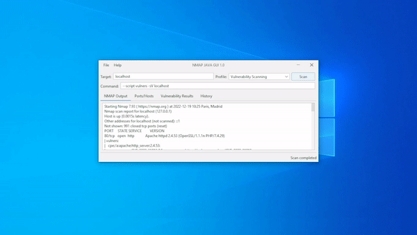

<h1 align="center">
    
</h1>

<h3 align="center">
  NmapGUI
</h3>

<p align="center">NMapGUI is an simple graphical user interface for NMap network analysis tool. It allows to extend and ease the typical usage of NMap by providing a visual and fast interface with the application.</p>

## Preview



## Features

✔️ Cross-platform (Linux, Windows)
✔️ Easy to use
✔️ Pretty interface
✔️ & More ...


## Requirements
A prerequisite is that you have Nmap installed on your machine

1. If your operating system is Linux, Install Nmap using the following command.

```shell
sudo apt-get install nmap
```

2. If your operating system is Windows, Go to [Nmap download link] (https://nmap.org/download.html#windows) and download the latest stable version, Go to the location where the file is downloaded, Right-click on the EXE file and click “Run as administrator.”, It will start installing NMAP and once done and you will get confirmation.

## License

NmapGUI is licensed under [GNU GPL](LICENSE).